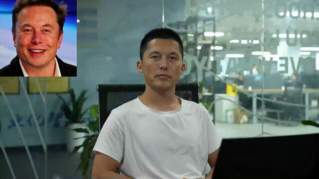
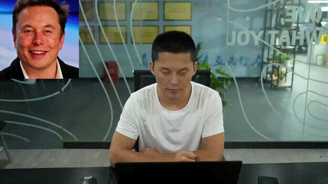

# ReHiFace-S 🤖🤖🤖

## 🚀 Introduction

ReHiFace-S, short for “Real Time High-Fidelity Faceswap”, is a real-time high-fidelity faceswap algorithm created by Silicon-based Intelligence. By open-sourcing the capabilities of digital human generation, developers can easily generate large-scale digital humans who they want, enabling real-time faceswap capability.

## 💪 Project features

- Real-time on NVIDIA GTX 1080Ti
- Zero-shot inference
- High Fidelity faceswap
- Support ONNX and live camera mode
- Support super resulution and color transfer
- Better Xseg model for face segment

## 🔥 **Examples**

We show some faceswap examples. </br>
<p align="center">
  
  <br>
</p>
<p align="center">
  
  <br>
</p>

## 🔧 Getting Started

### Clone the code and prepare the environment

- Python >= 3.9 (Recommend to use [Anaconda](https://www.anaconda.com/download/#linux) or [Miniconda](https://docs.conda.io/en/latest/miniconda.html))
- [PyTorch >= 1.13](https://pytorch.org/)
- CUDA 11.7
- Linux Ubuntu20.04 </br>

```bash
conda create --name faceswap python=3.9
conda activate faceswap
pip install -r requirements.txt
```

## 😊 Pretrained models

Download all pretrained weights from [Google Drive](https://drive.google.com/drive/folders/1hVWFXPIDwACqoKKtgXAJubYC_H4k5njc?usp=drive_link) or [Baidu Yun](https://pan.baidu.com/s/1Bn47xOjZg-oU7_WyAHu3EQ?pwd=9bjo). We have packed all weights in one directory 😊. Download and place them in `./pretrain_models` folder ensuring the directory structure is as follows:</br>
```python
pretrain_models
├── 9O_865k.onnx
├── CurricularFace.tjm
├── gfpganv14_fp32_bs1_scale.onnx
├── pfpld_robust_sim_bs1_8003.onnx
├── scrfd_500m_bnkps_shape640x640.onnx
├── xseg_230611_16_17.onnx
```

## 💻 How to Test

```python
CUDA_VISIBLE_DEICES='0' python inference.py
```
Or, you can change the input by specifying the `--src_img_path` and `--video_path` arguments:
```python
CUDA_VISIBLE_DEICES='0' python inference.py --src_img_path --video_path
```

### Live Cam faceswap

You should at least run by NVIDIA GTX 1080Ti.  </br>

***Notice: The time taken to render to a video and warm up the models are not included.*** </br>

Not support Super Resolution. 
```python
CUDA_VISIBLE_DEICES='0' python inference_cam.py
```
***Notice: Support change source face during live with 'data/image_feature_dict.pkl' !***
<p align="center">
  
  <br>
</p>
<p align="center">
  
  <br>
</p>

##  🤗 Gradio interface

We also provide a Gradio interface for a better experience, just run by:

```bash
python app.py
```

## ✨ Acknowledgments

- Thanks to [Hififace](https://github.com/johannwyh/HifiFace) for base faceswap framework.<br>
- Thanks to [CurricularFace](https://github.com/HuangYG123/CurricularFace) for pretrained face feature model.<br>
- Thanks to [Xseg](https://github.com/iperov/DeepFaceLab/tree/master) for base face segment framework.
- Thanks to [GFPGAN](https://github.com/TencentARC/GFPGAN) for face super resolution.
- Thanks to [LivePortrait](https://github.com/KwaiVGI/LivePortrait) and [duix.ai](https://github.com/GuijiAI/duix.ai) for README template.

 
## 🌟 Citation 

If you find ReHiFace-S useful for your research, welcome to 🌟 this repo.
